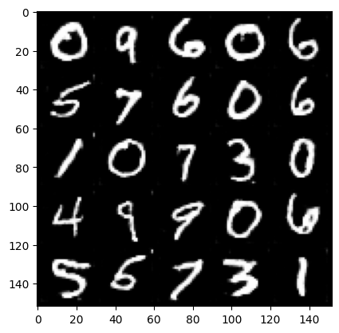

# GAN_project
personal project learning

at very beggining:
Epoch 4, step 2000: Generator loss: 4.2854847435951235, discriminator loss: 0.05559675728250295
true:

target:

Epoch 104, step 49000: Generator loss: 1.103884157180786, discriminator loss: 0.5457733340263367

predict:

target:

loss_score for both Generator/ Discriminator:

overview:

